# This is Crow'ler, my own joky twitter clone (not relevant now😔).

Welcome to Crow'ler, my whimsical take on a Twitter clone! 🐦 This pet project is all about learning and experimenting, so let's set the record straight right away: it's all in good fun, and there's no intention to spread hate or discrimination. 😄

## Learning Through Laughter

Crow'ler is my playground for honing my web development skills. I believe that learning should be enjoyable, and what's more fun than creating a playful social media platform? It's a joky pet project that reflects my passion for coding and my love for a good laugh.

## Features Galore

Here's what you can expect from Crow'ler:
- **Infinite Scroll:** Say goodbye to those pesky 'Load More' buttons. With Crow'ler, your timeline just keeps going and going, like an endless stream of tweets.
- **Virtual Scroll:** We're all about performance here. Virtual scrolling means you'll have a smooth and speedy experience, even if your timeline is bursting with tweets.
- **Powered by Nuxt:** Crow'ler is a testament to the power of Nuxt.js. We're doing all this magic on the frontend without relying on any heavyweight backend framework. It's pure Nuxt goodness!


## Screenshots

### Main Loader

<div style="display: flex; margin: 20px 0">
    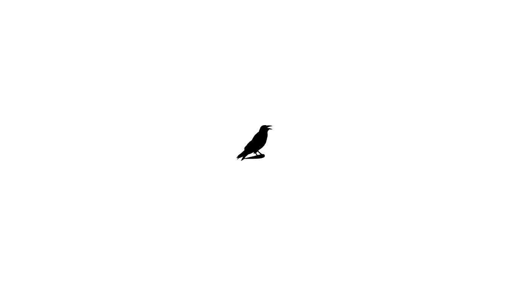
    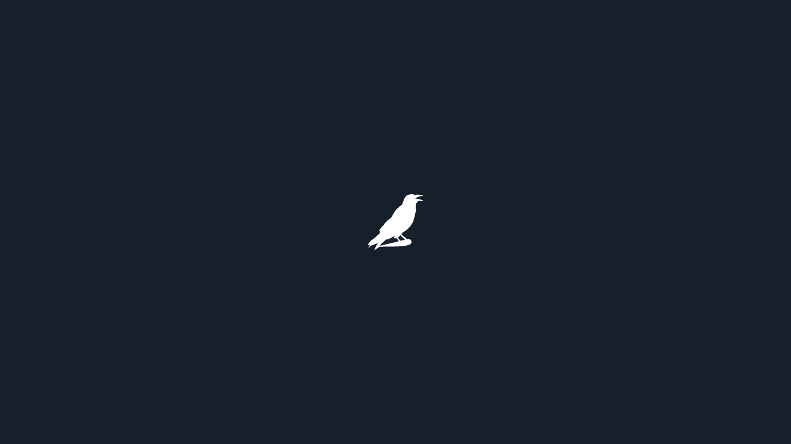
</div>

### Auth Pages
<div style="display: flex; margin: 20px 0">
    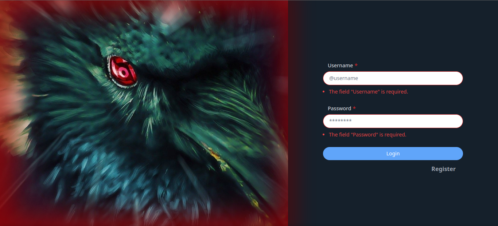
    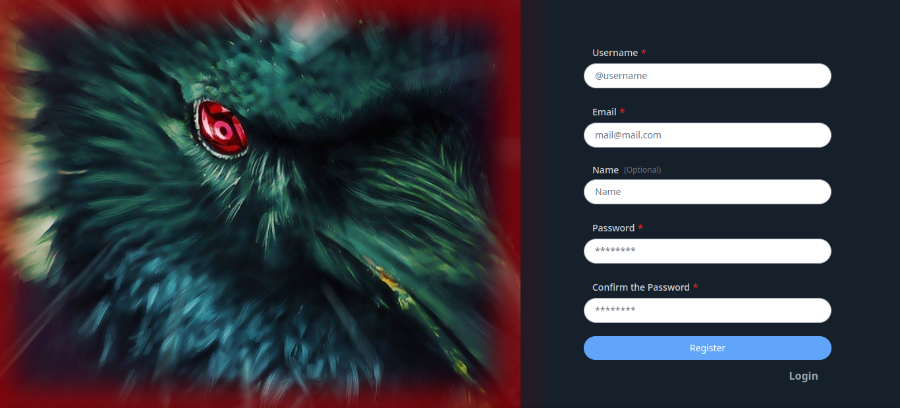
</div>

### Main Page
<div style="display: flex; margin: 20px 0">
    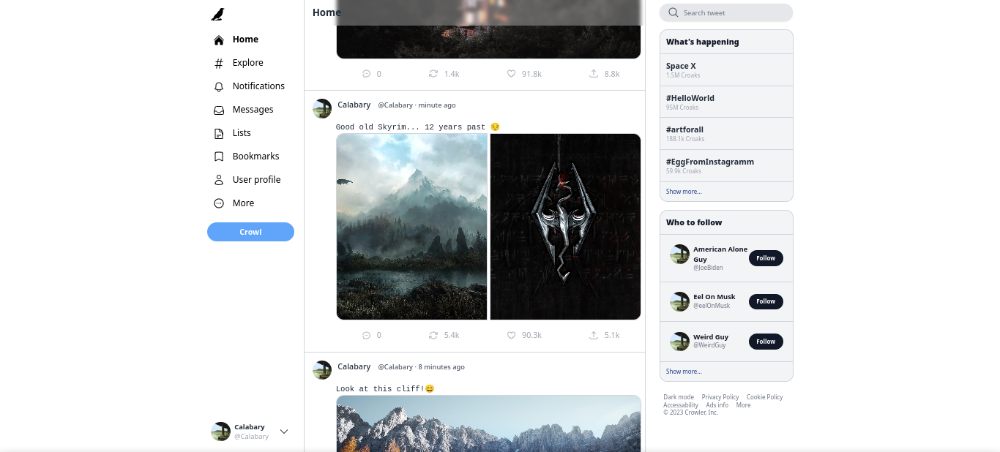
    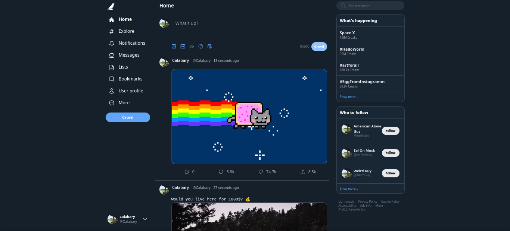
</div>

### Reply Page
<div style="display: flex; margin: 20px 0">
    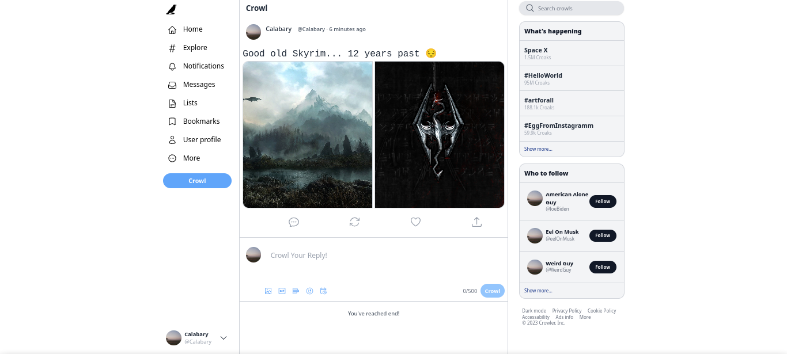
    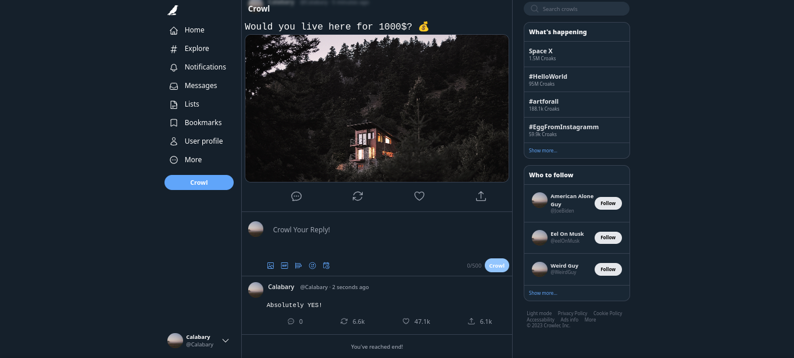
</div>

### Reply Modal
<div style="display: flex; margin: 20px 0">
    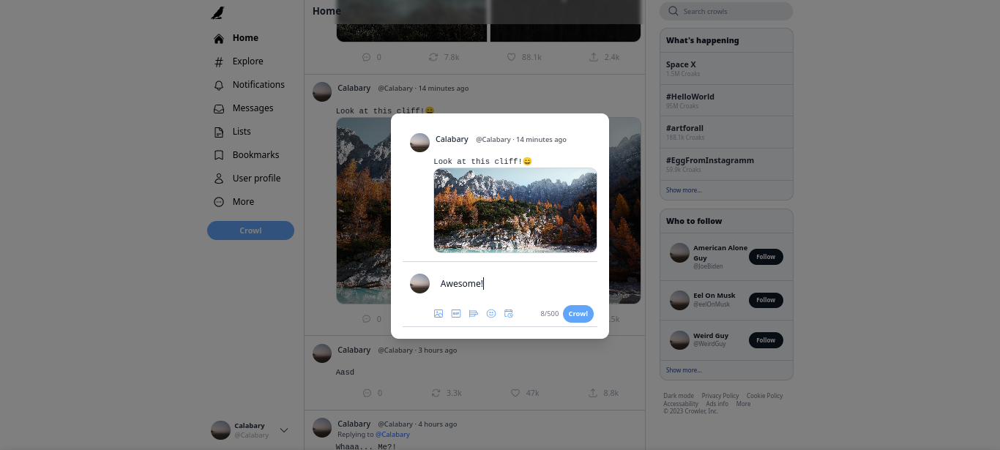
    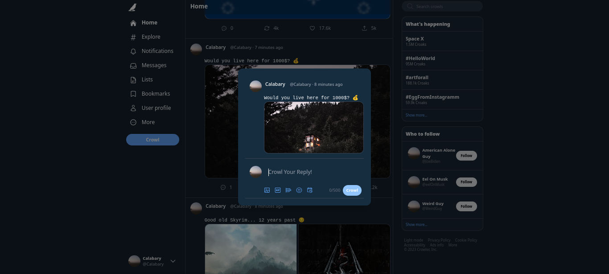
</div>

### Crowl modal
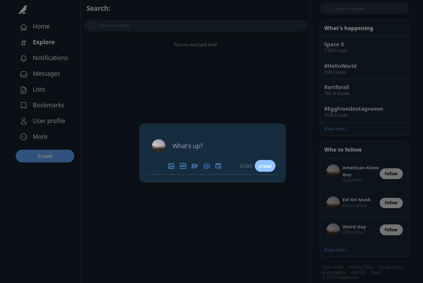


### Search page

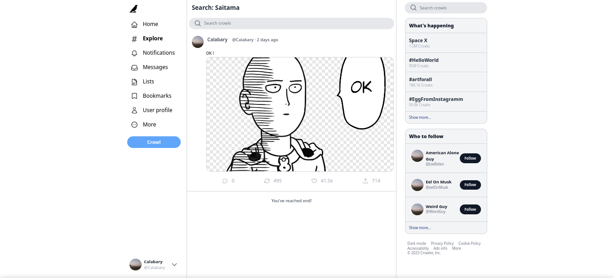
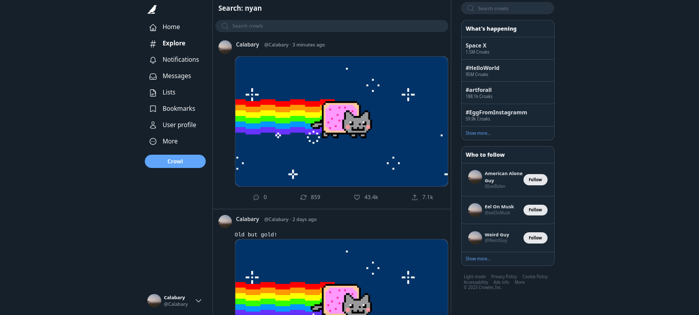


# Nuxt 3 Minimal Starter

Look at the [Nuxt 3 documentation](https://nuxt.com/docs/getting-started/introduction) to learn more.

## Setup

Make sure to install the dependencies:

```bash
# npm
npm install

# pnpm
pnpm install

# yarn
yarn install
```

## Development Server

Start the development server on `http://localhost:3000`:

```bash
# npm
npm run dev

# pnpm
pnpm run dev

# yarn
yarn dev
```

## Production

Build the application for production:

```bash
# npm
npm run build

# pnpm
pnpm run build

# yarn
yarn build
```

Locally preview production build:

```bash
# npm
npm run preview

# pnpm
pnpm run preview

# yarn
yarn preview
```

Check out the [deployment documentation](https://nuxt.com/docs/getting-started/deployment) for more information.
